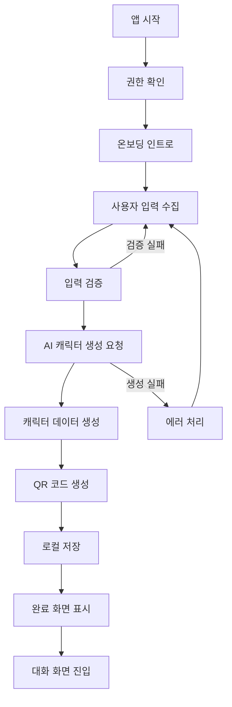

# 놈팽쓰 데이터 플로우 및 API 명세서

## 📋 문서 개요

본 문서는 온보딩 플로우에서의 데이터 흐름과 백엔드 API 연동 구조를 정의합니다.
AI 캐릭터 생성, QR 코드 관리, 사용자 데이터 처리 등의 상세 명세를 포함합니다.

---

## 🔄 데이터 플로우 다이어그램

### 📱 온보딩 전체 데이터 흐름



### 🗂️ 데이터 모델 구조

```dart
// features/onboarding/domain/entities/user_input.dart
class UserInput {
  final String nickname;
  final String location;
  final String duration;
  final String objectType;
  final DateTime createdAt;
  
  const UserInput({
    required this.nickname,
    required this.location,
    required this.duration,
    required this.objectType,
    required this.createdAt,
  });
  
  // 검증 로직
  bool get isValid {
    return nickname.isNotEmpty &&
           location.isNotEmpty &&
           duration.isNotEmpty &&
           objectType.isNotEmpty;
  }
  
  // Figma의 동적 텍스트 생성
  String get fullDescription => "${location}에서 ${duration} 함께한 ${objectType}";
}

// features/onboarding/domain/entities/character.dart
class Character {
  final String id;
  final String nickname;
  final String role;
  final String age;
  final String location;
  final List<String> personalityTags;
  final String speechBubbleText;
  final String imageUrl;
  final String qrCode;
  final String creatorId;
  final DateTime createdAt;
  
  const Character({
    required this.id,
    required this.nickname,
    required this.role,
    required this.age,
    required this.location,
    required this.personalityTags,
    required this.speechBubbleText,
    required this.imageUrl,
    required this.qrCode,
    required this.creatorId,
    required this.createdAt,
  });
  
  // TTS용 인사말
  String get greetingMessage => speechBubbleText;
  
  // 완료 알림 메시지
  String get completionMessage => "${nickname}이 깨어났어요!";
}
```

---

## 🌐 API 엔드포인트 명세

### 🏗️ Base Configuration

```dart
// config/api_config.dart
class ApiConfig {
  static const String baseUrl = 'https://api.nompangs.com';
  static const String version = 'v1';
  static const Duration timeout = Duration(seconds: 30);
  
  // 엔드포인트 경로
  static const String characterGeneration = '/characters/generate';
  static const String qrCodeGeneration = '/qr/generate';
  static const String userProfile = '/users/profile';
  static const String characterManagement = '/characters';
}
```

### 🤖 AI 캐릭터 생성 API

#### POST `/v1/characters/generate`

**요청 구조**:
```json
{
  "user_input": {
    "nickname": "털찐 말랑이",
    "location": "우리집 거실",
    "duration": "3개월",
    "object_type": "이 빠진 머그컵",
    "user_preferences": {
      "personality_intensity": 7,
      "warmth_level": 8,
      "energy_level": 5
    }
  },
  "generation_options": {
    "include_image": true,
    "include_voice_sample": false,
    "style_preference": "cute_friendly"
  }
}
```

**응답 구조**:
```json
{
  "success": true,
  "data": {
    "character": {
      "id": "char_abc123",
      "nickname": "털찐 말랑이",
      "role": "멘탈지기",
      "age": "25년생",
      "location": "우리집 거실",
      "personality_tags": ["#심신미약", "#소심이"],
      "speech_bubble_text": "가끔 털이 엉킬까봐 걱정돼 :(",
      "image_url": "https://cdn.nompangs.com/characters/char_abc123.png",
      "voice_settings": {
        "voice_id": "voice_001",
        "speed": 1.0,
        "pitch": 1.2
      },
      "creation_metadata": {
        "generation_time_ms": 3500,
        "model_version": "v2.1",
        "confidence_score": 0.92
      }
    },
    "qr_code": {
      "code": "QR_char_abc123_encoded",
      "qr_image_url": "https://cdn.nompangs.com/qr/char_abc123.png",
      "deep_link": "nompangs://character/char_abc123"
    }
  },
  "timestamp": "2024-12-01T10:30:00Z"
}
```

**에러 응답**:
```json
{
  "success": false,
  "error": {
    "code": "GENERATION_FAILED",
    "message": "캐릭터 생성에 실패했습니다. 다시 시도해주세요.",
    "details": {
      "reason": "AI_MODEL_TIMEOUT",
      "retry_after": 5
    }
  },
  "timestamp": "2024-12-01T10:30:00Z"
}
```

### 📱 QR 코드 관리 API

#### POST `/v1/qr/generate`

**요청 구조**:
```json
{
  "character_id": "char_abc123",
  "options": {
    "size": "medium",
    "include_logo": true,
    "background_color": "#ffffff",
    "foreground_color": "#000000"
  }
}
```

#### GET `/v1/qr/{qr_code}/info`

**응답 구조**:
```json
{
  "success": true,
  "data": {
    "character_id": "char_abc123",
    "is_active": true,
    "scan_count": 15,
    "last_scanned": "2024-12-01T09:45:00Z",
    "creator_info": {
      "user_id": "user_xyz789",
      "created_at": "2024-11-28T14:20:00Z"
    }
  }
}
```

---

## 🔄 Repository 패턴 구현

### 📱 OnboardingRepository

```dart
// features/onboarding/data/repositories/onboarding_repository_impl.dart
class OnboardingRepositoryImpl implements OnboardingRepository {
  final NetworkService _networkService;
  final StorageService _storageService;
  final Logger _logger;
  
  const OnboardingRepositoryImpl({
    required NetworkService networkService,
    required StorageService storageService,
    required Logger logger,
  }) : _networkService = networkService,
       _storageService = storageService,
       _logger = logger;

  @override
  Future<Character> generateCharacter(UserInput userInput) async {
    try {
      _logger.info('Starting character generation for: ${userInput.nickname}');
      
      // API 요청 데이터 변환
      final requestData = _buildGenerationRequest(userInput);
      
      // 캐릭터 생성 API 호출
      final response = await _networkService.post(
        '${ApiConfig.baseUrl}${ApiConfig.characterGeneration}',
        data: requestData,
        timeout: const Duration(seconds: 45), // AI 생성은 시간이 오래 걸림
      );
      
      // 응답 데이터 파싱
      final characterData = response.data['data']['character'];
      final qrData = response.data['data']['qr_code'];
      
      // 엔티티로 변환
      final character = Character.fromJson({
        ...characterData,
        'qr_code': qrData['code'],
      });
      
      // 로컬 저장
      await _storageService.saveCharacter(character);
      
      _logger.info('Character generation completed: ${character.id}');
      return character;
      
    } catch (e) {
      _logger.error('Character generation failed: $e');
      throw CharacterGenerationException(
        message: '캐릭터 생성에 실패했습니다.',
        cause: e,
      );
    }
  }
  
  @override
  Future<void> saveUserProgress(UserInput userInput) async {
    try {
      await _storageService.saveUserInput(userInput);
      _logger.info('User progress saved');
    } catch (e) {
      _logger.error('Failed to save user progress: $e');
      // 진행상황 저장 실패는 치명적이지 않으므로 예외를 던지지 않음
    }
  }
  
  @override
  Future<UserInput?> loadUserProgress() async {
    try {
      return await _storageService.loadUserInput();
    } catch (e) {
      _logger.error('Failed to load user progress: $e');
      return null;
    }
  }
  
  Map<String, dynamic> _buildGenerationRequest(UserInput userInput) {
    return {
      'user_input': {
        'nickname': userInput.nickname,
        'location': userInput.location,
        'duration': userInput.duration,
        'object_type': userInput.objectType,
        'user_preferences': {
          'personality_intensity': 7, // 기본값
          'warmth_level': 8,
          'energy_level': 5,
        }
      },
      'generation_options': {
        'include_image': true,
        'include_voice_sample': true,
        'style_preference': 'cute_friendly',
      }
    };
  }
}
```

### 📡 Network Service

```dart
// shared/services/network_service.dart
class NetworkService {
  final Dio _dio;
  final Logger _logger;
  
  NetworkService({
    required Logger logger,
  }) : _dio = Dio(),
       _logger = logger {
    _initializeInterceptors();
  }
  
  void _initializeInterceptors() {
    _dio.interceptors.addAll([
      // 로깅 인터셉터
      LogInterceptor(
        requestBody: true,
        responseBody: true,
        logPrint: (object) => _logger.debug(object.toString()),
      ),
      
      // 에러 처리 인터셉터
      InterceptorsWrapper(
        onError: (error, handler) {
          _handleNetworkError(error);
          handler.next(error);
        },
      ),
      
      // 토큰 인증 인터셉터
      InterceptorsWrapper(
        onRequest: (options, handler) async {
          final token = await _getAuthToken();
          if (token != null) {
            options.headers['Authorization'] = 'Bearer $token';
          }
          handler.next(options);
        },
      ),
    ]);
  }
  
  Future<Response> post(
    String url, {
    Map<String, dynamic>? data,
    Duration? timeout,
  }) async {
    try {
      final response = await _dio.post(
        url,
        data: data,
        options: Options(
          sendTimeout: timeout ?? ApiConfig.timeout,
          receiveTimeout: timeout ?? ApiConfig.timeout,
        ),
      );
      
      if (!response.data['success']) {
        throw ApiException.fromResponse(response);
      }
      
      return response;
    } on DioException catch (e) {
      throw _handleDioException(e);
    }
  }
  
  void _handleNetworkError(DioException error) {
    switch (error.type) {
      case DioExceptionType.connectionTimeout:
        _logger.error('Connection timeout: ${error.message}');
        break;
      case DioExceptionType.sendTimeout:
        _logger.error('Send timeout: ${error.message}');
        break;
      case DioExceptionType.receiveTimeout:
        _logger.error('Receive timeout: ${error.message}');
        break;
      case DioExceptionType.badResponse:
        _logger.error('Bad response: ${error.response?.statusCode}');
        break;
      default:
        _logger.error('Network error: ${error.message}');
    }
  }
  
  ApiException _handleDioException(DioException e) {
    switch (e.type) {
      case DioExceptionType.connectionTimeout:
      case DioExceptionType.sendTimeout:
      case DioExceptionType.receiveTimeout:
        return NetworkTimeoutException();
      case DioExceptionType.badResponse:
        return ApiException.fromResponse(e.response!);
      case DioExceptionType.cancel:
        return RequestCancelledException();
      default:
        return NetworkException(message: e.message);
    }
  }
  
  Future<String?> _getAuthToken() async {
    // Firebase Auth 토큰 또는 저장된 인증 토큰 반환
    return null; // 현재는 인증 없음
  }
}
```

---

## 💾 로컬 데이터 저장

### 🗃️ Storage Service

```dart
// shared/services/storage_service.dart
class StorageService {
  static const String _userInputKey = 'onboarding_user_input';
  static const String _characterKey = 'generated_character';
  static const String _progressKey = 'onboarding_progress';
  
  final SharedPreferences _prefs;
  final Logger _logger;
  
  const StorageService({
    required SharedPreferences prefs,
    required Logger logger,
  }) : _prefs = prefs,
       _logger = logger;
  
  // 사용자 입력 저장/로드
  Future<void> saveUserInput(UserInput userInput) async {
    try {
      final json = userInput.toJson();
      await _prefs.setString(_userInputKey, jsonEncode(json));
      _logger.info('User input saved to local storage');
    } catch (e) {
      _logger.error('Failed to save user input: $e');
      throw StorageException(message: 'Failed to save user input');
    }
  }
  
  Future<UserInput?> loadUserInput() async {
    try {
      final jsonString = _prefs.getString(_userInputKey);
      if (jsonString == null) return null;
      
      final json = jsonDecode(jsonString);
      return UserInput.fromJson(json);
    } catch (e) {
      _logger.error('Failed to load user input: $e');
      return null;
    }
  }
  
  // 생성된 캐릭터 저장/로드
  Future<void> saveCharacter(Character character) async {
    try {
      final json = character.toJson();
      await _prefs.setString(_characterKey, jsonEncode(json));
      _logger.info('Character saved to local storage: ${character.id}');
    } catch (e) {
      _logger.error('Failed to save character: $e');
      throw StorageException(message: 'Failed to save character');
    }
  }
  
  Future<Character?> loadCharacter() async {
    try {
      final jsonString = _prefs.getString(_characterKey);
      if (jsonString == null) return null;
      
      final json = jsonDecode(jsonString);
      return Character.fromJson(json);
    } catch (e) {
      _logger.error('Failed to load character: $e');
      return null;
    }
  }
  
  // 온보딩 진행상황 저장/로드
  Future<void> saveProgress(int currentStep) async {
    try {
      await _prefs.setInt(_progressKey, currentStep);
      _logger.info('Onboarding progress saved: step $currentStep');
    } catch (e) {
      _logger.error('Failed to save progress: $e');
    }
  }
  
  Future<int> loadProgress() async {
    try {
      return _prefs.getInt(_progressKey) ?? 0;
    } catch (e) {
      _logger.error('Failed to load progress: $e');
      return 0;
    }
  }
  
  // 데이터 삭제
  Future<void> clearOnboardingData() async {
    try {
      await Future.wait([
        _prefs.remove(_userInputKey),
        _prefs.remove(_characterKey),
        _prefs.remove(_progressKey),
      ]);
      _logger.info('Onboarding data cleared');
    } catch (e) {
      _logger.error('Failed to clear onboarding data: $e');
    }
  }
}
```

---

## 🎤 Audio Service (TTS)

### 🔊 TTS 구현

```dart
// shared/services/audio_service.dart
class AudioService {
  final flutter_tts.FlutterTts _flutterTts;
  final Logger _logger;
  
  bool _isInitialized = false;
  bool _isSpeaking = false;
  
  AudioService({
    required Logger logger,
  }) : _flutterTts = flutter_tts.FlutterTts(),
       _logger = logger;
  
  Future<void> initialize() async {
    if (_isInitialized) return;
    
    try {
      // TTS 설정
      await _flutterTts.setLanguage('ko-KR');
      await _flutterTts.setSpeechRate(1.0);
      await _flutterTts.setPitch(1.2);
      await _flutterTts.setVolume(0.8);
      
      // 콜백 설정
      _flutterTts.setCompletionHandler(() {
        _isSpeaking = false;
        _logger.info('TTS playback completed');
      });
      
      _flutterTts.setErrorHandler((message) {
        _logger.error('TTS error: $message');
        _isSpeaking = false;
      });
      
      _isInitialized = true;
      _logger.info('AudioService initialized');
    } catch (e) {
      _logger.error('Failed to initialize AudioService: $e');
      throw AudioServiceException(message: 'Failed to initialize TTS');
    }
  }
  
  Future<void> playCharacterGreeting(Character character) async {
    await _ensureInitialized();
    
    try {
      if (_isSpeaking) {
        await stopSpeaking();
      }
      
      _isSpeaking = true;
      await _flutterTts.speak(character.greetingMessage);
      _logger.info('Playing character greeting: ${character.nickname}');
    } catch (e) {
      _logger.error('Failed to play character greeting: $e');
      _isSpeaking = false;
      throw AudioServiceException(message: 'Failed to play greeting');
    }
  }
  
  Future<void> stopSpeaking() async {
    if (!_isInitialized || !_isSpeaking) return;
    
    try {
      await _flutterTts.stop();
      _isSpeaking = false;
      _logger.info('TTS stopped');
    } catch (e) {
      _logger.error('Failed to stop TTS: $e');
    }
  }
  
  bool get isSpeaking => _isSpeaking;
  
  Future<void> _ensureInitialized() async {
    if (!_isInitialized) {
      await initialize();
    }
  }
  
  void dispose() {
    _flutterTts.stop();
    _isInitialized = false;
    _isSpeaking = false;
  }
}
```

---

## 🔧 에러 처리 시스템

### 🚨 Exception Classes

```dart
// core/errors/exceptions.dart
abstract class AppException implements Exception {
  final String message;
  final String? code;
  final dynamic cause;
  
  const AppException({
    required this.message,
    this.code,
    this.cause,
  });
  
  @override
  String toString() => 'AppException(message: $message, code: $code)';
}

class NetworkException extends AppException {
  const NetworkException({
    required String message,
    String? code,
    dynamic cause,
  }) : super(message: message, code: code, cause: cause);
}

class NetworkTimeoutException extends NetworkException {
  const NetworkTimeoutException()
      : super(
          message: '네트워크 연결 시간이 초과되었습니다.',
          code: 'NETWORK_TIMEOUT',
        );
}

class ApiException extends AppException {
  final int? statusCode;
  
  const ApiException({
    required String message,
    String? code,
    this.statusCode,
    dynamic cause,
  }) : super(message: message, code: code, cause: cause);
  
  factory ApiException.fromResponse(Response response) {
    final data = response.data;
    return ApiException(
      message: data['error']['message'] ?? 'API 요청 중 오류가 발생했습니다.',
      code: data['error']['code'],
      statusCode: response.statusCode,
    );
  }
}

class CharacterGenerationException extends AppException {
  const CharacterGenerationException({
    required String message,
    String? code,
    dynamic cause,
  }) : super(message: message, code: code, cause: cause);
}

class StorageException extends AppException {
  const StorageException({
    required String message,
    String? code,
    dynamic cause,
  }) : super(message: message, code: code, cause: cause);
}

class AudioServiceException extends AppException {
  const AudioServiceException({
    required String message,
    String? code,
    dynamic cause,
  }) : super(message: message, code: code, cause: cause);
}
```

### 🛠️ Error Handler

```dart
// core/errors/error_handler.dart
class ErrorHandler {
  static String getErrorMessage(dynamic error) {
    if (error is AppException) {
      return error.message;
    } else if (error is DioException) {
      return _getDioErrorMessage(error);
    } else {
      return '알 수 없는 오류가 발생했습니다.';
    }
  }
  
  static String _getDioErrorMessage(DioException error) {
    switch (error.type) {
      case DioExceptionType.connectionTimeout:
        return '서버 연결 시간이 초과되었습니다.';
      case DioExceptionType.sendTimeout:
        return '요청 전송 시간이 초과되었습니다.';
      case DioExceptionType.receiveTimeout:
        return '응답 수신 시간이 초과되었습니다.';
      case DioExceptionType.badResponse:
        final statusCode = error.response?.statusCode;
        switch (statusCode) {
          case 400:
            return '잘못된 요청입니다.';
          case 401:
            return '인증이 필요합니다.';
          case 403:
            return '접근이 거부되었습니다.';
          case 404:
            return '요청한 리소스를 찾을 수 없습니다.';
          case 500:
            return '서버 내부 오류가 발생했습니다.';
          default:
            return '서버 오류가 발생했습니다. (${statusCode})';
        }
      case DioExceptionType.cancel:
        return '요청이 취소되었습니다.';
      default:
        return '네트워크 오류가 발생했습니다.';
    }
  }
  
  static void handleError(dynamic error, {
    required Function(String) onShowError,
    Function? onRetry,
  }) {
    final message = getErrorMessage(error);
    onShowError(message);
    
    // 재시도 가능한 에러인 경우
    if (_isRetryableError(error) && onRetry != null) {
      onRetry();
    }
  }
  
  static bool _isRetryableError(dynamic error) {
    if (error is NetworkTimeoutException) return true;
    if (error is DioException) {
      return error.type == DioExceptionType.connectionTimeout ||
             error.type == DioExceptionType.sendTimeout ||
             error.type == DioExceptionType.receiveTimeout;
    }
    return false;
  }
}
```

---

## 📊 데이터 검증 시스템

### ✅ Validation Utils

```dart
// core/utils/validators.dart
class Validators {
  // 닉네임 검증
  static String? validateNickname(String? value) {
    if (value == null || value.isEmpty) {
      return '이름을 입력해주세요!';
    }
    if (value.length < 2) {
      return '이름은 2글자 이상 입력해주세요!';
    }
    if (value.length > 20) {
      return '이름은 20글자 이하로 입력해주세요!';
    }
    if (!RegExp(r'^[가-힣a-zA-Z0-9\s]+$').hasMatch(value)) {
      return '한글, 영문, 숫자만 입력 가능합니다!';
    }
    return null;
  }
  
  // 위치 검증
  static String? validateLocation(String? value) {
    if (value == null || value.isEmpty) {
      return '위치를 선택해주세요!';
    }
    return null;
  }
  
  // 기간 검증
  static String? validateDuration(String? value) {
    if (value == null || value.isEmpty) {
      return '함께한 기간을 선택해주세요!';
    }
    return null;
  }
  
  // 사물 타입 검증
  static String? validateObjectType(String? value) {
    if (value == null || value.isEmpty) {
      return '사물의 종류를 입력해주세요!';
    }
    if (value.length < 2) {
      return '사물 이름은 2글자 이상 입력해주세요!';
    }
    return null;
  }
  
  // 전체 입력 검증
  static Map<String, String?> validateUserInput(UserInput userInput) {
    return {
      'nickname': validateNickname(userInput.nickname),
      'location': validateLocation(userInput.location),
      'duration': validateDuration(userInput.duration),
      'objectType': validateObjectType(userInput.objectType),
    };
  }
  
  // 검증 결과 확인
  static bool isValidationResultClean(Map<String, String?> validationResult) {
    return validationResult.values.every((error) => error == null);
  }
}
```

---

## 🔄 의존성 주입 설정

### 📦 Service Locator

```dart
// config/service_locator.dart
final GetIt serviceLocator = GetIt.instance;

Future<void> setupServiceLocator() async {
  // 외부 의존성
  final sharedPreferences = await SharedPreferences.getInstance();
  serviceLocator.registerSingleton<SharedPreferences>(sharedPreferences);
  
  // 핵심 서비스
  serviceLocator.registerSingleton<Logger>(Logger());
  serviceLocator.registerSingleton<NetworkService>(
    NetworkService(logger: serviceLocator<Logger>()),
  );
  serviceLocator.registerSingleton<StorageService>(
    StorageService(
      prefs: serviceLocator<SharedPreferences>(),
      logger: serviceLocator<Logger>(),
    ),
  );
  serviceLocator.registerSingleton<AudioService>(
    AudioService(logger: serviceLocator<Logger>()),
  );
  
  // Repository
  serviceLocator.registerSingleton<OnboardingRepository>(
    OnboardingRepositoryImpl(
      networkService: serviceLocator<NetworkService>(),
      storageService: serviceLocator<StorageService>(),
      logger: serviceLocator<Logger>(),
    ),
  );
  
  // Use Cases
  serviceLocator.registerFactory<GenerateCharacterUseCase>(
    () => GenerateCharacterUseCase(
      repository: serviceLocator<OnboardingRepository>(),
    ),
  );
  serviceLocator.registerFactory<ValidateUserInputUseCase>(
    () => ValidateUserInputUseCase(),
  );
  
  // Providers
  serviceLocator.registerFactory<OnboardingProvider>(
    () => OnboardingProvider(
      generateCharacterUseCase: serviceLocator<GenerateCharacterUseCase>(),
      validateUserInputUseCase: serviceLocator<ValidateUserInputUseCase>(),
      storageService: serviceLocator<StorageService>(),
      audioService: serviceLocator<AudioService>(),
      logger: serviceLocator<Logger>(),
    ),
  );
}
```

---

## 📱 Provider 통합 구현

### 🔄 Enhanced OnboardingProvider

```dart
// features/onboarding/presentation/providers/onboarding_provider.dart
class OnboardingProvider extends ChangeNotifier {
  final GenerateCharacterUseCase _generateCharacterUseCase;
  final ValidateUserInputUseCase _validateUserInputUseCase;
  final StorageService _storageService;
  final AudioService _audioService;
  final Logger _logger;
  
  OnboardingProvider({
    required GenerateCharacterUseCase generateCharacterUseCase,
    required ValidateUserInputUseCase validateUserInputUseCase,
    required StorageService storageService,
    required AudioService audioService,
    required Logger logger,
  }) : _generateCharacterUseCase = generateCharacterUseCase,
       _validateUserInputUseCase = validateUserInputUseCase,
       _storageService = storageService,
       _audioService = audioService,
       _logger = logger {
    _initializeProvider();
  }
  
  // 상태 변수들
  int _currentStep = 0;
  UserInput? _userInput;
  Character? _generatedCharacter;
  Map<String, String?> _validationErrors = {};
  bool _isGenerating = false;
  String? _errorMessage;
  
  // Getters
  int get currentStep => _currentStep;
  UserInput? get userInput => _userInput;
  Character? get generatedCharacter => _generatedCharacter;
  Map<String, String?> get validationErrors => _validationErrors;
  bool get isGenerating => _isGenerating;
  String? get errorMessage => _errorMessage;
  
  // 동적 텍스트 (Figma {} 처리)
  String get welcomeMessage => 
      "${_userInput?.objectType ?? '사물'}이 깨어났어요!";
  String get characterAge => "${DateTime.now().year - 1999}년생";
  String get fullDescription => _userInput?.fullDescription ?? '';
  
  // 현재 단계 유효성 검사
  bool get isCurrentStepValid {
    switch (_currentStep) {
      case 0: return true; // 인트로는 항상 유효
      case 1: return _userInput != null && 
                     Validators.isValidationResultClean(_validationErrors);
      case 2: return _isGenerating || _generatedCharacter != null;
      case 3: return _generatedCharacter != null;
      default: return false;
    }
  }
  
  // 초기화
  Future<void> _initializeProvider() async {
    try {
      // 저장된 진행상황 복원
      final savedStep = await _storageService.loadProgress();
      final savedInput = await _storageService.loadUserInput();
      final savedCharacter = await _storageService.loadCharacter();
      
      if (savedInput != null) {
        _userInput = savedInput;
        _validateCurrentInput();
      }
      
      if (savedCharacter != null) {
        _generatedCharacter = savedCharacter;
        _currentStep = 3; // 완료 단계로 이동
      } else if (savedStep > 0) {
        _currentStep = savedStep;
      }
      
      notifyListeners();
    } catch (e) {
      _logger.error('Failed to initialize onboarding provider: $e');
    }
  }
  
  // 사용자 입력 업데이트
  void updateUserInput({
    String? nickname,
    String? location,
    String? duration,
    String? objectType,
  }) {
    _userInput = UserInput(
      nickname: nickname ?? _userInput?.nickname ?? '',
      location: location ?? _userInput?.location ?? '',
      duration: duration ?? _userInput?.duration ?? '',
      objectType: objectType ?? _userInput?.objectType ?? '',
      createdAt: _userInput?.createdAt ?? DateTime.now(),
    );
    
    _validateCurrentInput();
    _saveProgress();
    notifyListeners();
  }
  
  // 입력 검증
  void _validateCurrentInput() {
    if (_userInput != null) {
      _validationErrors = _validateUserInputUseCase.call(_userInput!);
    }
  }
  
  // 다음 단계로 이동
  void nextStep() {
    if (_currentStep < 3 && isCurrentStepValid) {
      _currentStep++;
      _saveProgress();
      notifyListeners();
    }
  }
  
  // 이전 단계로 이동
  void previousStep() {
    if (_currentStep > 0) {
      _currentStep--;
      _clearError();
      notifyListeners();
    }
  }
  
  // 캐릭터 생성 시작
  Future<void> generateCharacter() async {
    if (_userInput == null || !isCurrentStepValid) return;
    
    try {
      _isGenerating = true;
      _clearError();
      notifyListeners();
      
      _logger.info('Starting character generation');
      
      _generatedCharacter = await _generateCharacterUseCase.call(_userInput!);
      
      _logger.info('Character generation completed: ${_generatedCharacter!.id}');
      
      nextStep(); // 완료 단계로 이동
      
    } catch (e) {
      _logger.error('Character generation failed: $e');
      _errorMessage = ErrorHandler.getErrorMessage(e);
    } finally {
      _isGenerating = false;
      notifyListeners();
    }
  }
  
  // 캐릭터 인사말 재생
  Future<void> playCharacterGreeting() async {
    if (_generatedCharacter == null) return;
    
    try {
      await _audioService.playCharacterGreeting(_generatedCharacter!);
    } catch (e) {
      _logger.error('Failed to play character greeting: $e');
      _errorMessage = ErrorHandler.getErrorMessage(e);
      notifyListeners();
    }
  }
  
  // TTS 중지
  Future<void> stopGreeting() async {
    try {
      await _audioService.stopSpeaking();
    } catch (e) {
      _logger.error('Failed to stop greeting: $e');
    }
  }
  
  // 진행상황 저장
  Future<void> _saveProgress() async {
    try {
      await _storageService.saveProgress(_currentStep);
      if (_userInput != null) {
        await _storageService.saveUserInput(_userInput!);
      }
    } catch (e) {
      _logger.error('Failed to save progress: $e');
    }
  }
  
  // 온보딩 데이터 리셋
  Future<void> resetOnboarding() async {
    try {
      await _storageService.clearOnboardingData();
      _currentStep = 0;
      _userInput = null;
      _generatedCharacter = null;
      _validationErrors.clear();
      _isGenerating = false;
      _clearError();
      notifyListeners();
    } catch (e) {
      _logger.error('Failed to reset onboarding: $e');
    }
  }
  
  // 에러 메시지 클리어
  void _clearError() {
    _errorMessage = null;
  }
  
  // 에러 재시도
  Future<void> retryLastAction() async {
    if (_currentStep == 2 && _userInput != null) {
      await generateCharacter();
    }
  }
  
  @override
  void dispose() {
    _audioService.dispose();
    super.dispose();
  }
}
```

---

**문서 버전**: v1.0  
**최종 수정**: 2024년 12월  
**작성자**: NomPangS Development Team 